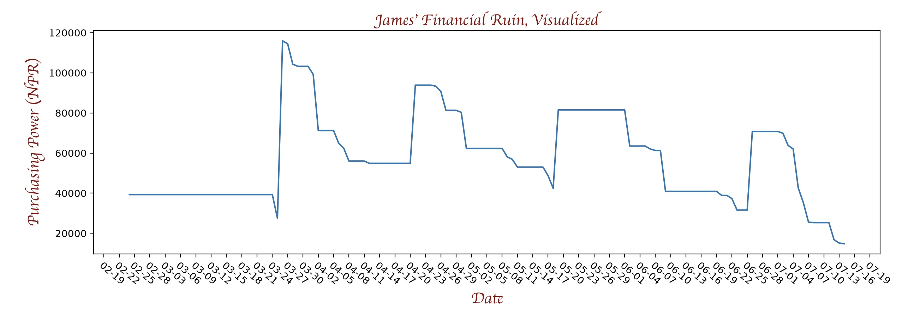

## Financial Ruin Display

This project is designed to scrape your email with IMAP for transaction alerts from Nabil Bank,
parse the data from those emails, and display a line graph of your spending over time.

### How To Run

* Install python3
* Install requirements.txt
* Create an app password for your gmail account
* (optional) add environment variables for gmail username and password. Alternatively you can input these at runtime.
* Run "src/main.py"

### TODO
* work on the UX - e.g., pickle file exists? No? Generate. Check for newer version of file. etc.
* Allow users to input their name / title
* Prompt users for login creds if not found
* solution for if user has too much data to fit in a reasonable graph size
* line that follows cursor?
* Allow for multiple lines of different colors to compare user spending?
* If user isn't scraping from email, no need to connect to internet / IMAP services
* Currently this application assumes you are using gmail. Need to either extend to other IMAP servers or make that more apparent.
